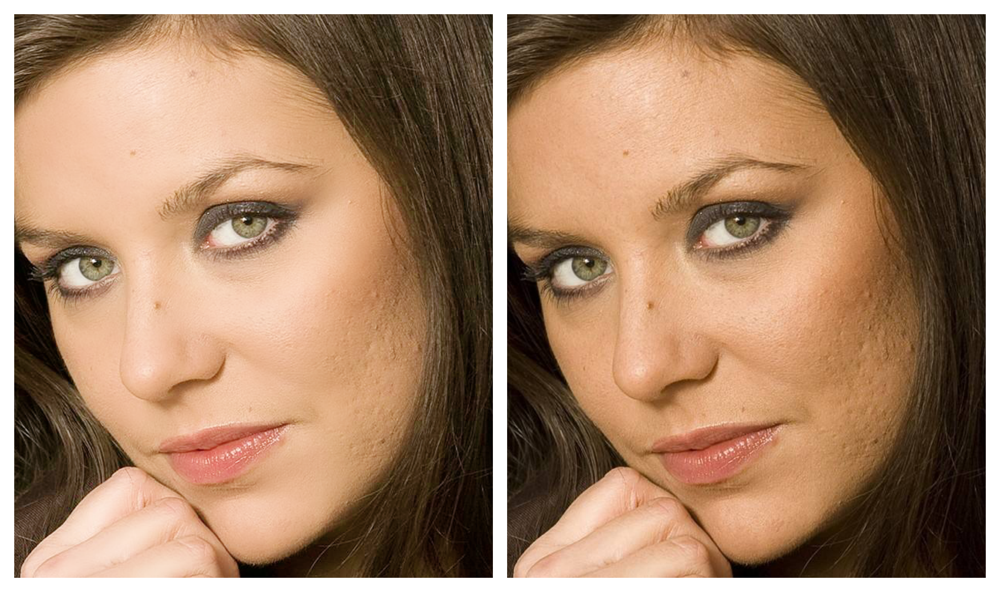

# pixelFree 商业级美颜SDK

#### 项目介绍

**pixelFree** 是基于个人几年对图形学习，总结开发的SDK, 主要用于直播，短时视频领域.....

主要功能包含：美白，红润，磨皮，锐化，大眼，瘦脸.....

SDK 免费开放，目前仅支持iOS平台，人脸部分依赖face++提供的106点ai功能,想要美型，贴纸，美妆…..等功能，需要在**MGNetAccount.h**中添加*api_key*  和 *api_secret*

集成接入参考  *pixelFreeEffects* 演示**DEMO**

注：演示所有素材均来源于网络，如有侵权邮件告知 ios_sunmu@icloud.com,将第一时间删除

#### 美颜效果 :

演示参数：美白（0.6），红润（0.6），磨皮（0.7），锐化（0.2）

更多美型，贴纸.....运行demo体验

#### 更新日志

**2020-9-5 日更新**

优化：

- 异步人脸检测

- 缓存高代价对象

iphone 8* 测试
*CPU:54%*
*渲染耗时：*
|            | 打开项（美白,红润,磨皮,锐化,滤镜,大眼,瘦脸,V脸,下巴） |
| ---------- | :---------------------------------------------------: |
| 耗时（ms） |                         5.2ms                         |

不开人脸变形耗时6.4ms,原因：功能少的时候，CPU 只开了 4核

**2020-9-3 日更新**

基于对美颜，美型，滤镜，贴纸，美妆原理理解。实现高质量美颜SDK **pixelFree.framework ** ,版本 v1.0.1

*iphone 8* 测试

*CPU:54%*

*渲染耗时：*

|            | 打开项（美白,红润,磨皮,锐化,滤镜,大眼,瘦脸,V脸,下巴） |
| ---------- | :---------------------------------------------------: |
| 耗时（ms） |                        18.6ms                         |

