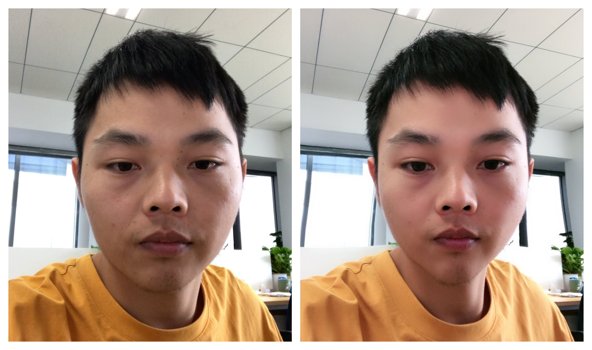

# pixelFree 商业级美颜SDK

#### 项目介绍

**pixelFree** 是基于个人几年对图形学习，总结开发的SDK, 主要用于直播，短视频领域.....

主要功能包含：美白，红润，磨皮，锐化，大眼，瘦脸…….

集成接入参考  *pixelFreeEffects* 演示**DEMO**

注：演示所有素材均来源于网络，如有侵权邮件告知 ios_sunmu@icloud.com,将第一时间删除

#### 美颜效果 :

磨皮的同时，保留更多细节，美化与真实并存

**演示1**  参数：美白（0.6），红润（0.6），磨皮（0.7），锐化（0.2），大眼（1.0），瘦脸（1.0），v脸（1.0），下巴（1.0）



#### 接入使用

1. 初始化

   ```
   // 素材路径
   NSString *face_FiltePath = [[NSBundle mainBundle] pathForResource:@"face_fiter.bundle" ofType:nil];
   NSString *face_DetectPath = [[NSBundle mainBundle] pathForResource:@"face_detect.bundle" ofType:nil];
       
   // 初始化实例
    _mPixelFree = [[SMPixelFree alloc] initWithProcessContext:nil srcFilterPath:face_FiltePath srcDetectPath:face_DetectPath];
   ```

2. 美颜参数设置

    ```
   // 大眼
   [_mPixelFree pixelFreeSetBeautyFiterParam:PFBeautyFiterTypeFace_EyeStrength value:&value]; 
   ```

3. 滤镜设置

   ```
   // 滤镜类型，类型字段查看，滤镜表格
   const char *aaa = [param.mParam UTF8String];
   [_mPixelFree pixelFreeSetBeautyFiterParam:PFBeautyFiterName value:(void *)aaa];
   // 滤镜程度
   [_mPixelFree pixelFreeSetBeautyFiterParam:PFBeautyFiterStrength value:&value];
   ```

4. 图像渲染处理，内部会内存回写

   ```
   // pixbuffer 视频数据
   [_mPixelFree processWithBuffer:pixbuffer];
   ```

   

   

#### 更新日志


**2022-09-3 日更新** v2.0.1

1. add andriod JNI and Demo
2. 调优美型算法

**2021-11-20 日更新** v2.0.0

1. c++ 重构sdk
2. 提供 SO 库
3. 移除动态贴纸，3D贴纸功能

**2020-12-31 日更新** v1.1.2

1. 修复异常crash

2. 美型切换到cpu上执行，通过网格减少运算，降低gpu负荷


**2020-12-05 日更新** v1.1.0

1.添加3D贴纸（使用配置json，仅测试了.obj格式模型）

2.添加新美白（阴影保护的更好，减少噪点引入）

3.新增画质增强功能

4.修复滤镜造成画面异常bug


**2020-10-11 日更新**

架构 日志系统，code_type，具备远程分析能力 ；默认LogLevelDebug。


**2020-9-20 日更新**  v1.0.3

1. 效果优化:

- **目前只有texture接口，算法需要数据，需要glFinish() 阻塞，render耗时 +3ms,但是大大提升了贴纸跟随**

2. 修复bug

- 人脸快速消失，crash问题
- 第一次进入会鉴权失败问题 

iphone 8 **测试**
*CPU:68%*   **cpu 百分比有提升，但是只跑了4个核**
*渲染耗时：*

|            | 打开项（美白,红润,磨皮,锐化,滤镜,大眼,瘦脸,V脸,下巴） |
| ---------- | :---------------------------------------------------: |
| 耗时（ms） |          8.2ms （+3ms来自cpu获取数据的阻塞）          |


**2020-9-12 日更新**

优化：

- 去除drawCall, 去除多余gl指令，

iphone 8 **测试**
*CPU:54%*
*渲染耗时：*

|            | 打开项（美白,红润,磨皮,锐化,滤镜,大眼,瘦脸,V脸,下巴） |
| ---------- | :---------------------------------------------------: |
| 耗时（ms） |                         4.6ms                         |


**2020-9-5 日更新**

优化：

- 异步人脸检测

- 缓存高代价对象

iphone 8 **测试**
*CPU:56%*
*渲染耗时：*

|            | 打开项（美白,红润,磨皮,锐化,滤镜,大眼,瘦脸,V脸,下巴） |
| ---------- | :---------------------------------------------------: |
| 耗时（ms） |                         5.2ms                         |

不开人脸变形耗时6.4ms,原因：功能少的时候，CPU 只开了 4核


**2020-9-3 日更新**

基于对美颜，美型，滤镜，贴纸，美妆原理理解。实现高质量美颜SDK **pixelFree.framework ** ,版本 v1.0.1

*iphone 8* **测试**

*CPU:54%*

*渲染耗时：*

|            | 打开项（美白,红润,磨皮,锐化,滤镜,大眼,瘦脸,V脸,下巴） |
| ---------- | :---------------------------------------------------: |
| 耗时（ms） |                        18.6ms                         |


