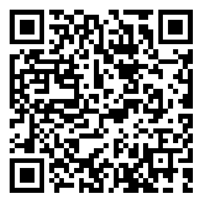

# pixelFree 商业级美颜SDK

[English Version](./README_en.md)

#### 项目介绍

**pixelFree** 是基于个人几年对图形学习，总结开发的SDK, 轻量级高性能，主要用于直播，短视频，证件照.....

主要功能包含：美白，红润，磨皮，锐化，大眼，瘦脸…….

集成接入参考  *pixelFreeEffects* 演示**DEMO**

注：演示所有素材均来源于网络，如有侵权邮件告知（微信号：17376595626 email:idphoto007@163.com）,将第一时间删除

#### 美颜效果 

磨皮的同时，保留更多细节，美化与真实并存

**演示1**  参数：美白（0.6），红润（0.6），磨皮（0.7），锐化（0.2），大眼（1.0），瘦脸（1.0），v脸（1.0），下巴（1.0）

**演示2**：动态贴纸

#### 美颜全开性能

   

#### 支持的平台系统

|  平台   |  系统  |
| :-----: | :----: |
|   iOS   | > 9.0  |
| Andriod | >  5.0 |
| harmonyOS | >  12.0  |
| flutter |   -    |

#### 美颜功能列表

| 功能             | 子功能                                                       |
| ---------------- | ------------------------------------------------------------ |
| **基础美颜**     | **美白、磨皮、红润、锐化、亮眼、画质增强**                   |
| **滤镜**         | **50款 可选**                                                |
| **美型**         | **大眼、瘦脸、窄脸、额头、下巴、瘦鼻、 V脸、短脸、人中、长鼻、眼距、微笑嘴角、旋转眼睛、开眼角** |
| **一键美颜**     | **自然、可爱、女神、白净**                                   |
| **相机调色**     | **亮度,对比度,曝光,高光,阴影,饱和度,色温,色相全局 HLS, 根据关键是调节** |
| **人脸贴**       | **60款 2D 贴纸可选**                                         |
| **绿幕背景替换** |                                                              |
| **自定义水印**   |                                                              |

#### 已经支持适配的音视频厂商

七牛云，声网，腾讯，即构

####  接入 pixelfree

[iOS 接入文档](./doc/doc_iOS.md)

[android 接入文档](./doc/doc_android.md)

[常见问题](./doc/frequently_asked_questions.md)

[更新日志](./doc/release_note.md)

[自定义贴纸](./doc/custom_stickers.md)

####  Android 体验 demo：https://www.pgyer.com/Cy9pG8

####  iOS 体验 demo ：https://testflight.apple.com/join/KWUMyqrh

