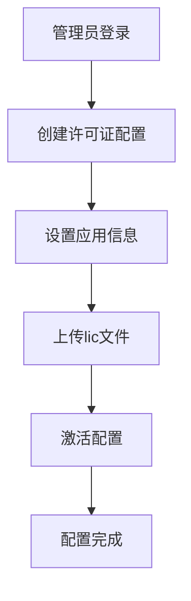
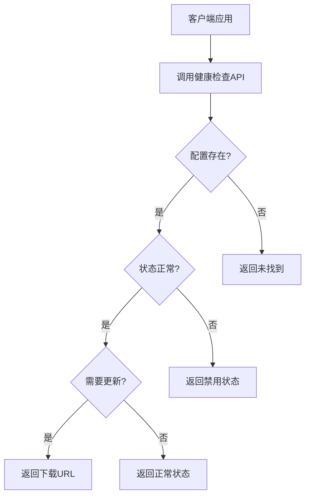

# SMBeautyEngine License Health Check API

SMBeautyEngine 许可证健康检查 API 服务，基于数据表配置管理，支持管理员配置证书信息和上传lic文件。

## 功能特性

- ✅ **健康检查** - 服务状态监控
- ✅ **证书健康检查** - 检查应用证书状态，自动判断是否需要更新
- ✅ **数据表配置管理** - 基于JSON数据表的许可证配置管理
- ✅ **证书文件上传** - 支持上传和管理lic文件
- ✅ **管理员接口** - 完整的CRUD管理接口
- ✅ **RSA 数字签名** - 确保证书安全性和完整性
- ✅ **多平台支持** - 支持 Android、iOS、Flutter 等平台
- ✅ **状态管理** - 支持 active、expired、disabled 状态

## 系统架构

```
┌─────────────────┐    ┌─────────────────┐    ┌─────────────────┐
│   客户端应用     │    │   管理后台       │    │   API服务       │
│                 │    │                 │    │                 │
│ - 健康检查      │    │ - 配置管理      │    │ - 健康检查      │
│ - 证书检查      │    │ - 文件上传      │    │ - 证书检查      │
│ - 文件下载      │    │ - 状态管理      │    │ - 文件下载      │
└─────────────────┘    └─────────────────┘    └─────────────────┘
                                │                       │
                                └───────────────────────┘
                                        │
                                ┌─────────────────┐
                                │   数据存储       │
                                │                 │
                                │ - 配置JSON文件   │
                                │ - lic文件目录    │
                                │ - RSA密钥对      │
                                └─────────────────┘
```

## 快速开始

### 1. 安装依赖

```bash
# 确保已安装 Go 1.19+
go mod download
```

### 2. 启动服务

```bash
# 开发模式
go run main.go

# 或使用启动脚本（自动选择可用端口）
./start.sh

# 或指定端口启动
PORT=15000 go run main.go

# 或使用编译后的二进制文件
PORT=15000 ./smbeauty-license-api
```

### 3. 测试服务

```bash
# 使用测试脚本
./test_api.sh --url http://localhost:15000

# 或使用 Go 客户端示例
go run client_example.go

# 或使用管理客户端
go run admin_client.go

# 或使用完整演示
./demo.sh --url http://localhost:15000
```

## API 接口

### 1. 健康检查

**GET** `/health`

检查服务运行状态。

**响应示例：**
```json
{
  "status": "healthy",
  "timestamp": "2024-01-15T10:30:00Z",
  "version": "1.0.0"
}
```

### 2. 证书健康检查

**POST** `/api/license/health`

检查指定应用的证书健康状态。

**请求参数：**
```json
{
  "app_bundle_id": "com.example.myapp"
}
```

**响应示例：**
```json
{
  "success": true,
  "data": {
    "app_bundle_id": "com.example.myapp",
    "needs_update": false,
    "expires_at": "2025-12-31T23:59:59Z",
    "days_until_expiry": 190,
    "status": "active",
    "message": "许可证配置正常",
    "features": ["beauty", "filter", "sticker"],
    "version": "2.4.9"
  }
}
```

**当需要更新时：**
```json
{
  "success": true,
  "data": {
    "app_bundle_id": "com.example.myapp",
    "needs_update": true,
    "expires_at": "2024-02-15T10:30:00Z",
    "days_until_expiry": 15,
    "download_url": "http://localhost:15000/api/license/download/com.example.myapp",
    "status": "needs_update",
    "message": "许可证需要更新"
  }
}
```

### 3. 下载证书文件

**GET** `/api/license/download/{app_bundle_id}`

下载指定应用的证书文件（`pixelfreeAuth.lic`）。

**响应：**
- 成功：返回证书文件
- 失败：返回错误信息

## 管理接口

### 1. 创建许可证配置

**POST** `/api/admin/license/config`

创建新的许可证配置。

**请求参数：**
```json
{
  "app_bundle_id": "com.example.myapp",
  "status": "active",
  "expires_at": "2025-12-31T23:59:59Z",
  "features": ["beauty", "filter", "sticker"],
  "version": "2.4.9",
  "platform": "android",
  "description": "Android应用许可证",
  "created_by": "admin"
}
```

**响应示例：**
```json
{
  "success": true,
  "message": "许可证配置创建成功"
}
```

### 2. 更新许可证配置

**PUT** `/api/admin/license/config/{app_bundle_id}`

更新指定应用的许可证配置。

**请求参数：**
```json
{
  "status": "active",
  "expires_at": "2026-12-31T23:59:59Z",
  "features": ["beauty", "filter", "sticker", "background"],
  "version": "2.5.0",
  "description": "更新后的许可证配置",
  "updated_by": "admin"
}
```

### 3. 获取许可证配置

**GET** `/api/admin/license/config/{app_bundle_id}`

获取指定应用的许可证配置详情。

**响应示例：**
```json
{
  "success": true,
  "data": {
    "app_bundle_id": "com.example.myapp",
    "status": "active",
    "expires_at": "2025-12-31T23:59:59Z",
    "features": ["beauty", "filter", "sticker"],
    "version": "2.4.9",
    "platform": "android",
    "description": "Android应用许可证",
    "license_file": "pixelfreeAuth.lic",
    "created_by": "admin",
    "updated_by": "system",
    "created_at": "2024-01-15T10:30:00Z",
    "updated_at": "2024-01-15T10:35:00Z"
  }
}
```

### 4. 列出所有许可证配置

**GET** `/api/admin/license/configs`

获取所有许可证配置列表。

**响应示例：**
```json
{
  "success": true,
  "data": [
    {
      "app_bundle_id": "com.example.myapp",
      "status": "active",
      "expires_at": "2025-12-31T23:59:59Z",
      "features": ["beauty", "filter", "sticker"],
      "version": "2.4.9",
      "platform": "android",
      "description": "Android应用许可证",
      "license_file": "pixelfreeAuth.lic",
      "created_by": "admin",
      "updated_by": "system",
      "created_at": "2024-01-15T10:30:00Z",
      "updated_at": "2024-01-15T10:35:00Z"
    }
  ]
}
```

### 5. 删除许可证配置

**DELETE** `/api/admin/license/config/{app_bundle_id}`

删除指定应用的许可证配置。

### 6. 上传许可证文件

**POST** `/api/admin/license/upload/{app_bundle_id}`

上传指定应用的许可证文件。

**请求：**
- Content-Type: `multipart/form-data`
- 参数名: `license_file`

**响应示例：**
```json
{
  "success": true,
  "message": "许可证文件上传成功"
}
```

## 实际使用示例

### 完整工作流程演示

```bash
# 1. 启动服务
PORT=15000 go run main.go

# 2. 创建许可证配置
curl -X POST http://localhost:15000/api/admin/license/config \
  -H "Content-Type: application/json" \
  -d '{
    "app_bundle_id": "com.example.myapp",
    "status": "active",
    "expires_at": "2025-12-31T23:59:59Z",
    "features": ["beauty", "filter", "sticker"],
    "version": "2.4.9",
    "platform": "android",
    "description": "Android应用许可证",
    "created_by": "admin"
  }'

# 3. 上传许可证文件
curl -X POST http://localhost:15000/api/admin/license/upload/com.example.myapp \
  -F "license_file=@licenses/pixelfreeAuth.lic"

# 4. 检查许可证状态
curl -X POST http://localhost:15000/api/license/health \
  -H "Content-Type: application/json" \
  -d '{"app_bundle_id": "com.example.myapp"}'

# 5. 下载许可证文件
curl http://localhost:15000/api/license/download/com.example.myapp

# 6. 查看所有配置
curl http://localhost:15000/api/admin/license/configs
```

### cURL 示例

```bash
# 健康检查
curl http://localhost:15000/health

# 证书健康检查
curl -X POST http://localhost:15000/api/license/health \
  -H "Content-Type: application/json" \
  -d '{"app_bundle_id": "com.example.myapp"}'

# 下载证书文件
curl -O http://localhost:15000/api/license/download/com.example.myapp

# 创建许可证配置
curl -X POST http://localhost:15000/api/admin/license/config \
  -H "Content-Type: application/json" \
  -d '{
    "app_bundle_id": "com.example.myapp",
    "status": "active",
    "expires_at": "2025-12-31T23:59:59Z",
    "features": ["beauty", "filter", "sticker"],
    "version": "2.4.9",
    "platform": "android",
    "description": "Android应用许可证",
    "created_by": "admin"
  }'

# 上传许可证文件
curl -X POST http://localhost:15000/api/admin/license/upload/com.example.myapp \
  -F "license_file=@pixelfreeAuth.lic"
```

### JavaScript/TypeScript 客户端

```javascript
class LicenseClient {
    constructor(baseURL = 'http://localhost:15000') {
        this.baseURL = baseURL;
    }

    async checkHealth() {
        const response = await fetch(`${this.baseURL}/health`);
        return await response.json();
    }

    async checkLicenseHealth(appBundleId) {
        const response = await fetch(`${this.baseURL}/api/license/health`, {
            method: 'POST',
            headers: {
                'Content-Type': 'application/json',
            },
            body: JSON.stringify({ app_bundle_id: appBundleId })
        });
        return await response.json();
    }

    async downloadLicense(appBundleId) {
        const response = await fetch(`${this.baseURL}/api/license/download/${appBundleId}`);
        if (response.ok) {
            const blob = await response.blob();
            const url = window.URL.createObjectURL(blob);
            const a = document.createElement('a');
            a.href = url;
            a.download = 'pixelfreeAuth.lic';
            a.click();
        }
    }
}

// 使用示例
const client = new LicenseClient();
client.checkLicenseHealth('com.example.myapp').then(result => {
    if (result.success && result.data.needs_update) {
        client.downloadLicense('com.example.myapp');
    }
});
```

## 配置说明

### 环境变量

| 变量名 | 默认值 | 说明 |
|--------|--------|------|
| `PORT` | `5000` | 服务端口 |
| `LICENSE_DIR` | `licenses` | 证书文件存储目录 |
| `PRIVATE_KEY_PATH` | `keys/private_key.pem` | 私钥文件路径 |
| `PUBLIC_KEY_PATH` | `keys/public_key.pem` | 公钥文件路径 |
| `LICENSE_VALIDITY_DAYS` | `365` | 证书有效期（天） |
| `LOG_LEVEL` | `info` | 日志级别 |
| `DOWNLOAD_BASE_URL` | `http://localhost:5000` | 下载URL基础地址 |
| `DATA_FILE` | `data/license_configs.json` | 配置数据文件路径 |

### 配置文件

创建 `.env` 文件进行配置：

```env
PORT=15000
LICENSE_DIR=licenses
LICENSE_VALIDITY_DAYS=365
LOG_LEVEL=info
DOWNLOAD_BASE_URL=http://localhost:15000
DATA_FILE=data/license_configs.json
```

## 数据表结构

### 许可证配置表 (data/license_configs.json)

```json
[
  {
    "app_bundle_id": "com.example.myapp",
    "status": "active",
    "expires_at": "2025-12-31T23:59:59Z",
    "features": ["beauty", "filter", "sticker"],
    "version": "2.4.9",
    "platform": "android",
    "description": "Android应用许可证",
    "license_file": "pixelfreeAuth.lic",
    "created_by": "admin",
    "updated_by": "system",
    "created_at": "2024-01-15T10:30:00Z",
    "updated_at": "2024-01-15T10:35:00Z"
  }
]
```

### 字段说明

| 字段名 | 类型 | 说明 |
|--------|------|------|
| `app_bundle_id` | string | 应用包名（唯一标识） |
| `status` | string | 状态：active/expired/disabled |
| `expires_at` | datetime | 过期时间 |
| `features` | array | 功能列表 |
| `version` | string | SDK版本 |
| `platform` | string | 平台：android/ios/flutter |
| `description` | string | 描述信息 |
| `license_file` | string | 对应的lic文件名 |
| `created_by` | string | 创建者 |
| `updated_by` | string | 更新者 |
| `created_at` | datetime | 创建时间 |
| `updated_at` | datetime | 更新时间 |

## 部署

### Docker 部署

```bash
# 构建镜像
docker build -t smbeauty-license-api .

# 运行容器
docker run -d -p 15000:15000 \
  -e PORT=15000 \
  -e LICENSE_VALIDITY_DAYS=365 \
  -e DOWNLOAD_BASE_URL=http://localhost:15000 \
  -v $(pwd)/data:/app/data \
  -v $(pwd)/licenses:/app/licenses \
  smbeauty-license-api
```

### Docker Compose 部署

```bash
# 启动服务
docker-compose up -d

# 查看日志
docker-compose logs -f

# 停止服务
docker-compose down
```

### 生产环境部署

```bash
# 编译
make build

# 运行
PORT=15000 ./smbeauty-license-api
```

## 开发

### 项目结构

```
SMUpdateCertificate/
├── main.go              # 主程序
├── client_example.go    # 客户端示例
├── admin_client.go      # 管理客户端示例
├── test_api.sh          # API测试脚本
├── demo.sh              # 完整演示脚本
├── Dockerfile           # Docker配置
├── docker-compose.yml   # Docker Compose配置
├── Makefile             # 构建脚本
├── go.mod               # Go模块文件
├── data/                # 数据目录
│   └── license_configs.json  # 配置数据文件
├── licenses/            # 许可证文件目录
│   └── pixelfreeAuth.lic     # 许可证文件
├── keys/                # RSA密钥目录
│   ├── private_key.pem  # 私钥
│   └── public_key.pem   # 公钥
└── README.md            # 文档
```

### 常用命令

```bash
# 运行测试
make test

# 代码格式化
make fmt

# 代码检查
make lint

# 构建
make build

# 运行
make run

# Docker构建
make docker-build

# Docker运行
make docker-run

# 管理演示
go run admin_client.go

# 完整演示
./demo.sh --url http://localhost:15000
```

## 工作流程

### 1. 管理员配置流程



### 2. 客户端检查流程



## 安全说明

- 使用 RSA-2048 密钥对进行数字签名
- 证书文件包含 SHA256 哈希验证
- 私钥文件权限设置为 600
- 支持证书过期时间验证
- 管理接口建议在生产环境中添加认证

## 故障排除

### 常见问题

1. **服务启动失败**
   ```bash
   # 检查端口是否被占用
   lsof -i :15000
   
   # 检查权限
   chmod +x start.sh
   ```

2. **配置加载失败**
   ```bash
   # 检查数据目录权限
   ls -la data/
   
   # 检查配置文件格式
   cat data/license_configs.json | jq .
   ```

3. **文件上传失败**
   ```bash
   # 检查许可证目录权限
   ls -la licenses/
   
   # 检查磁盘空间
   df -h
   ```

4. **密钥解析失败**
   ```bash
   # 删除旧密钥，重新生成
   rm -rf keys/private_key.pem keys/public_key.pem
   ```

### 日志查看

```bash
# 查看服务日志
tail -f logs/app.log

# 查看Docker日志
docker-compose logs -f
```

## 许可证

本项目遵循 MIT 许可证。

## 支持

如有问题，请提交 Issue 或联系开发团队。 